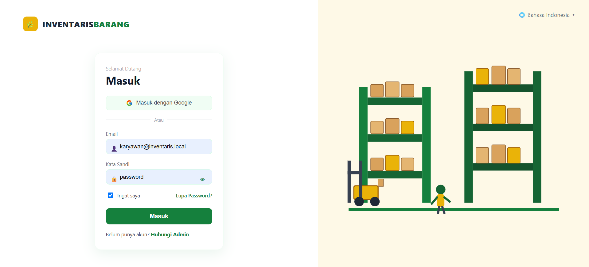
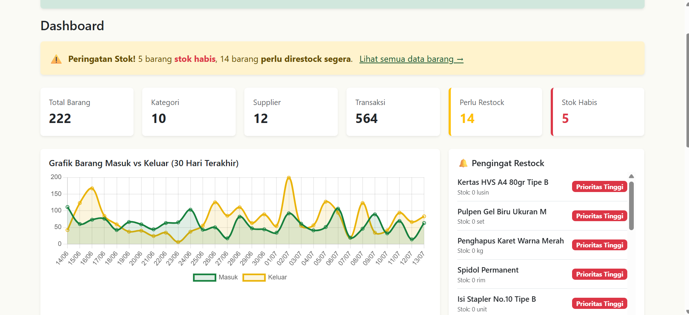
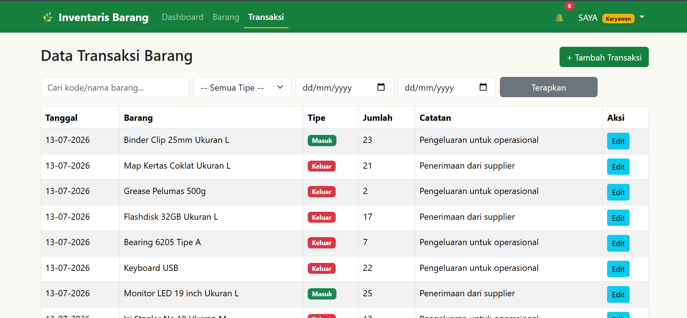
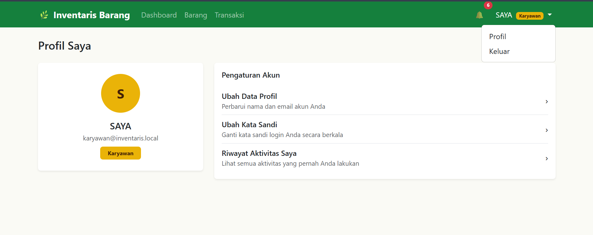
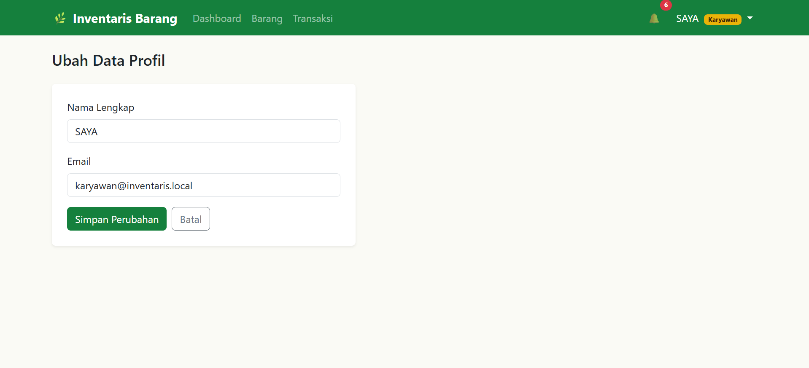
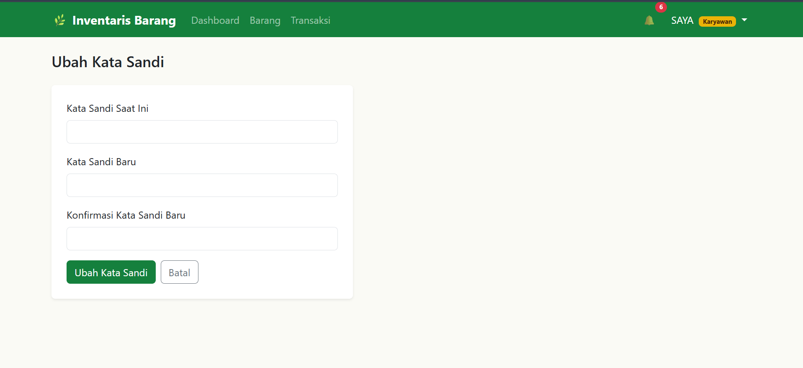
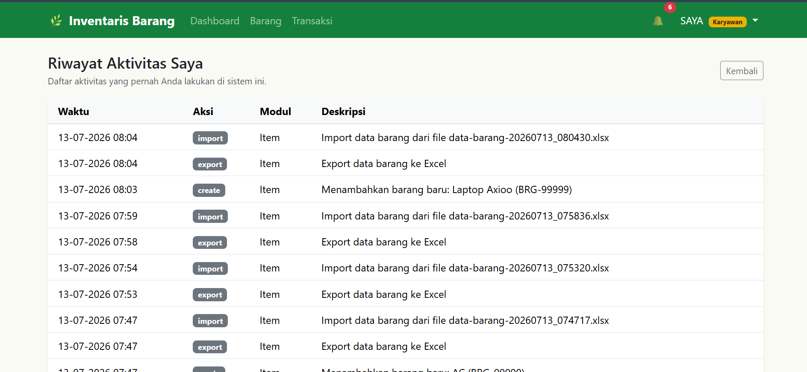

# 📦 Sistem Inventaris Barang

Sistem Inventaris Barang merupakan aplikasi berbasis web yang dikembangkan menggunakan **Laravel 12** untuk membantu proses pengelolaan inventaris secara lebih efektif dan efisien. Aplikasi ini menyediakan fitur pengelolaan data barang, transaksi barang masuk dan keluar, import dan export data, pemantauan stok secara real-time, serta pengingat restock agar pengelolaan inventaris menjadi lebih mudah.

---

## ✨ Fitur Utama

- 🔐 Login Authentication
- 📊 Dashboard Informasi Inventaris
- 📦 CRUD Data Barang
- 📑 CRUD Data Transaksi
- 🔍 Pencarian Data
- 🎯 Filter Data
- 📥 Import Data Excel (.xlsx)
- 📤 Export Data Excel (.xlsx)
- 📤 Export Data CSV
- ⚠️ Notifikasi Barang Habis
- 🔔 Pengingat Restock
- 📈 Grafik Barang Masuk & Keluar
- 👤 Pengaturan Profil
- ✏️ Ubah Nama Pengguna
- 🔑 Ubah Kata Sandi
- 📜 Riwayat Aktivitas Pengguna
- ✅ Validasi Form
- 📱 Responsive Design

---

## 🛠️ Teknologi yang Digunakan

- Laravel 12
- PHP 8.2
- MySQL
- Bootstrap 5
- Blade Template
- JavaScript
- Chart.js
- Laravel Excel

---

## 📸 Screenshot Aplikasi

### 🔐 Login



Halaman autentikasi pengguna untuk masuk ke dalam sistem.

---

### 📊 Dashboard



Dashboard menampilkan ringkasan data inventaris, grafik barang masuk dan keluar, jumlah stok, notifikasi stok habis, serta pengingat restock.

---

### 📦 Data Barang


Halaman pengelolaan data barang dengan fitur CRUD, pencarian, filter, import data dari Excel, export ke Excel dan CSV.

---

### 📑 Data Transaksi



Halaman pencatatan transaksi barang masuk dan barang keluar lengkap dengan pencarian dan filter berdasarkan tanggal maupun jenis transaksi.

---

### 👤 Setting Profile



Halaman profil pengguna yang menampilkan informasi akun serta menu pengaturan akun.

---

### ✏️ Setting Nama Pengguna



Halaman untuk mengubah nama lengkap dan email pengguna.

---

### 🔑 Ubah Kata Sandi



Halaman untuk memperbarui kata sandi akun agar keamanan tetap terjaga.

---

### 📜 Riwayat Aktivitas



Halaman yang menampilkan seluruh aktivitas pengguna di dalam sistem, seperti tambah, ubah, hapus, import, dan export data.

---

## 🚀 Cara Menjalankan Project

Clone repository

```bash
git clone https://github.com/indahpurnama5800-cell/inventaris-barang.git
```

Masuk ke folder project

```bash
cd inventaris-barang
```

Install dependency

```bash
composer install
```

Install package frontend

```bash
npm install
```

Salin file environment

```bash
cp .env.example .env
```

Generate application key

```bash
php artisan key:generate
```

Atur konfigurasi database pada file **.env**, kemudian jalankan migrasi database.

```bash
php artisan migrate --seed
```

Jalankan Vite

```bash
npm run dev
```

Jalankan server Laravel

```bash
php artisan serve
```

Buka browser

```
http://127.0.0.1:8000
```

---

## 👩‍💻 Developer

**Indah Purnama**

SMK Negeri 7 Pekanbaru

Jurusan Rekayasa Perangkat Lunak (RPL)

---

## 📄 License

Project ini dibuat untuk keperluan pembelajaran dan tugas sekolah.
